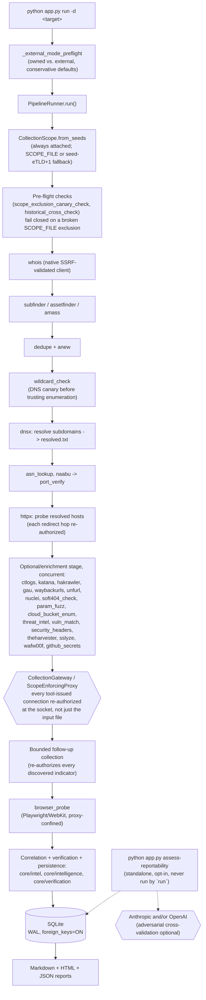

# Hydra — scope-aware reconnaissance with evidence-backed intelligence

[](https://github.com/Andres-Montoya-SV/hydra/actions/workflows/ci.yml)

**Authorization:** only scan systems you own or have explicit written permission to test. See [AUTHORIZED_USE.md](AUTHORIZED_USE.md). Licensed under [MIT](LICENSE).

---

## What Hydra is

Hydra is a working, non-trivial reconnaissance pipeline: roughly 25 tool
plugins (subfinder, dnsx, httpx, katana, nuclei, and more — some
mandatory, most optional) orchestrated by an async runner, gated
end-to-end by a real scope/authorization layer and a live confinement
proxy that routes every tool-issued connection — not just the initial
input file — through an authorization check before it reaches the
network. On top of that sit four independent, tested intelligence layers,
each a standalone, opt-in step a human reviews — never authoritative over
scope or evidence on its own:

- An OSINT **correlation engine** that turns shared certificates/IPs into
  evidence-backed relationships, never attribution
  (`docs/CORRELATION_ENGINE_DESIGN.md`).
- A deterministic **verification agent** that doubts Hydra's own results
  before they reach a report (`docs/VERIFICATION_AGENT_DESIGN.md`).
- An LLM-backed **reportability agent** (`python app.py
  assess-reportability`; Claude and/or OpenAI, with optional adversarial
  cross-validation between the two) that triages whether a finding is
  likely eligible under a program's own bounty rules
  (`docs/REPORTABILITY_AGENT_DESIGN.md`).
- An LLM-backed **hypothesis engine** (`python app.py
  suggest-hypotheses`) that reads a run's already-correlated
  relationships and proposes investigation leads a human analyst would
  want to look at — every factual claim it cites is mechanically
  re-verified against the real SQLite data for that run, never trusted on
  the LLM's word alone (`docs/HYPOTHESIS_ENGINE_DESIGN.md`).

A fifth, non-LLM standalone command (`python app.py client-report`) turns
a run's persisted findings into a plain-language, tool-name-free draft
report — Markdown or Word — ready for a human to review before it ever
reaches a client (`docs/CLIENT_REPORT.md`).

Driving `run`, then `assess-reportability`, then `client-report` by hand,
in the right order, is a lot to remember — `python app.py engagement`
chains exactly those steps into one guided flow, with the same
cost-estimate-and-confirm gate before it ever calls an LLM and the same
"never sent automatically" guarantee on the draft it produces. It's
sugar over the individual commands, not a replacement for them: every
command above still works exactly the same on its own, and `engagement`
never runs anything an operator wouldn't have run by hand.

Everything persists to SQLite with real, enforced foreign keys. It ships
as a non-root Docker image with a minimally-scoped Linux capability set,
and has real CI across three Python versions plus a containerized
network-confinement re-verification on every pull request. As of the
most recent full audit (`docs/FINAL_PROJECT_AUDIT.md`), 844 tests pass
consistently and reproducibly — see that document, and the "Known
limitations" section below, for exactly what does not work yet rather
than a marketing gloss over it.

## Why it exists

Hydra's correlation engine exists because of one real case, not a
hypothetical: a piece of malicious infrastructure at `virusbarrier.xyz`
turned out to be one of **six** related domains
(`virusbarrier.xyz`, `virusinspector.top`, `cybermedic.buzz`,
`defendervault.shop`, `shieldvertex.mom`, `safesentinel.lol`) — all
fronted by the same Google Cloud Platform IP and, crucially, all named as
Subject Alternative Names on the exact same TLS certificate. Manually
reconstructing that kind of cluster — pulling every SAN off a
certificate, checking which ones share an IP, deciding which similarity
is coincidence and which is real infrastructure reuse — is exactly the
work a bug bounty researcher redoes by hand, program after program.
Hydra's correlation engine automates the reconstruction (`docs/CORRELATION_ENGINE_DESIGN.md`,
`tests/test_virusbarrier_e2e.py`, which replays this exact case).

But a tool that goes looking for related infrastructure automatically is
also a tool that could, without real discipline, start actively probing
things nobody authorized it to touch. `virusinspector.top` and its
siblings were **never** actively collected against by Hydra — they are
recorded purely as observations (a SAN on a certificate is data, not
permission). That distinction — and being able to *prove* it holds, run
after run, without a human re-checking every log — is the second reason
this project exists: a reconnaissance tool a researcher can actually trust
to respect a program's scope unsupervised, not one that merely claims to.

## Architecture



This is the real, current flow, verified directly against `core/runner.py`
— not an idealized version. Full detail (every network sink and what
gates it, the three intelligence layers, known architectural gaps):
[`docs/ARCHITECTURE.md`](docs/ARCHITECTURE.md). Security-specific call-path
detail: [`docs/NETWORK_CONFINEMENT.md`](docs/NETWORK_CONFINEMENT.md).

## Quickstart

**Docker is the recommended path** — it's the only way to guarantee every
Go binary, `nmap`, and Playwright/WebKit are the exact pinned versions
this project tests against, regardless of what's already on your host.

```bash
git clone <this-repo> && cd hydra
docker build -t hydra:local .

# One-time host setup — the image runs as a non-root uid:gid (10001:10001)
mkdir -p docker-data/output docker-data/logs docker-data/reports
sudo chown -R 10001:10001 docker-data
cp scope.example.txt scope.txt   # then edit for your program
cp config/.env.example .env      # then edit — every variable is documented there

docker compose run hydra python app.py run -d example.com
```

See [`docs/DOCKER.md`](docs/DOCKER.md) for the full guide (volume layout,
injecting secrets without baking them into the image, investigating past
results without a rescan, running the test suite inside the container).

**Native installation** is supported as an alternative on macOS, Ubuntu,
Debian, and Kali — Python 3.10+, Go 1.21+, and each tool installed
individually (`brew install subfinder dnsx httpx` on macOS, `go install`
for the rest). Full tool-by-tool install commands:
[`docs/DOCKER.md`](docs/DOCKER.md)'s tool table, or run
`python app.py check-tools` after a manual install to verify what's
actually on `PATH`.

## Example

A real run from this project's own foundational case
(`SCOPE_FILE` limited to `virusbarrier.xyz`, no follow-up beyond the
authorized seed):

```bash
python app.py run -d virusbarrier.xyz --no-ui --run-id confinement-proof-20260831
```

What actually happened on that real run (recorded in
`intel_network_requests`, quoted verbatim in
`docs/archive/FINAL_NETWORK_CONFINEMENT_AUDIT_2026-08-31.md` — not
re-run for this README, since re-scanning a live third-party domain isn't
something to do casually just to produce documentation; this is the
project's real, historical result):

- **4 ALLOW** — the authorized target itself, resolved to `34.75.127.116`.
- **15 DENY** — real connection attempts the *tools themselves* tried to
  make on their own, to five different out-of-scope domains sharing the
  same TLS certificate as the seed (`cybermedic.buzz`, `defendervault.shop`,
  `safesentinel.lol`, `shieldvertex.mom`, `virusinspector.top`) — httpx
  redirect hops and nuclei's own default templates both tried to reach
  them; all 15 were refused by `ScopeEnforcingProxy` before a socket ever
  opened (`network_attempted=false`).
- `alive.txt`/`resolved.txt` contain **only** `virusbarrier.xyz` — the
  five siblings are recorded as **observations** (they're real, they share
  real infrastructure with the seed) but never became collection targets.
- `python app.py graph virusbarrier.xyz` reconstructs the full 6-domain
  cluster from that observation data — the correlation engine's whole
  reason for existing (see "Why it exists" above).

Query it afterward without rescanning:

```bash
python app.py investigate virusbarrier.xyz
python app.py graph virusbarrier.xyz
python app.py relationships virusbarrier.xyz
```

`investigate` prints analyst-readable explanations for each relationship
(certificate fingerprint, SAN cardinality, cloud tenancy, a named
confidence band) — never actor/owner/campaign attribution language, by
design (see Security model below).

### Guided end-to-end: `engagement`

The four commands above (`run`, `investigate`/`verification-flags`,
`assess-reportability`, `client-report`) are also available as one guided
flow that runs them in that order and stops to ask before anything
optional:

```bash
python app.py engagement -d example.com --program-rules rules.txt
```

1. Runs the pipeline (headless — no dashboard, so the prompts below print
   normally) and immediately shows the same `investigate`/
   `verification-flags` summary those commands print on their own.
2. If `--program-rules` was given and a provider key is configured, shows
   the real cost estimate and asks to confirm — the exact same gate
   `assess-reportability` uses standalone, not a second, different one.
   No key configured, or `--program-rules` omitted? It skips this step
   with a clear message instead of asking a question it already knows
   the answer to.
3. Asks whether to generate a client-report draft (and in which format).
4. Prints a final summary of what was generated and where — nothing is
   sent or published on your behalf.

Declining either question ends the flow cleanly right there (not an
error) and still shows what was generated up to that point. In a
non-interactive context (no TTY) it never assumes "yes" for a
money-spending step — it fails closed instead, unless you pass
`--skip-reportability` / `--skip-client-report` explicitly:

```bash
python app.py engagement -d example.com --skip-reportability --skip-client-report
```

Every one of these commands still works exactly the same when run by
itself — `engagement` only chains their existing entry points, it doesn't
replace or weaken any of them.

## Security model

Three layers, in plain terms:

1. **`SCOPE_FILE` is the authorization.** A plain text file of domains and
   wildcards (`*.example.com`), with `!`-prefixed lines carving out
   exclusions — a whole domain (`!internal.example.com`) or a specific
   path (`!example.com/whistleblowing`, which also protects everything
   *beneath* that path, not just the exact URL). Nothing in Hydra treats
   "I have a `CollectionScope` object" as itself meaning "this specific
   hostname is authorized" — every single active check re-asks the
   question against the actual name in front of it.
2. **`CollectionGateway`/`ScopeEnforcingProxy` are the real barrier**, not
   the input file alone. Early in this project's history, the input file
   was the only check — a tool that discovered a new URL on its own
   (a redirect, a crawled link, a template's own OOB callback) could still
   reach it, because nothing re-checked authorization at the moment of
   the actual connection. Today, every tool that can reach the target
   goes through one of two mechanisms: a sealed object
   (`AuthorizedCollectionTarget`) that literally cannot be constructed
   from a raw, unauthorized string, or a local forward proxy that
   authorizes the **resolved IP** — not just the hostname — before
   connecting, and pins the connection to that exact IP (closing
   DNS-rebinding). Both are proven against real installed binaries and a
   real local server, not mocks — 22 live tests, re-verified
   2026-09-13 with zero unauthorized connections.
3. **The verification agent doubts Hydra's own results.** Before any
   collection starts, it re-checks that a configured scope *exclusion*
   actually works (the project once shipped a wildcard-exclusion bug that
   silently protected nothing — the check that catches that exact bug now
   runs on every single scan). After collection, it looks for internal
   contradictions in what was just observed — a DNS record that looks
   resolved but is actually NODATA, for instance — and downgrades or
   excludes affected findings from the report rather than presenting them
   at full confidence.

**Known limit, stated plainly, not hidden**: `naabu`'s port scanning uses
raw TCP/SYN packets, which cannot be routed through an HTTP forward proxy
at all — there is no way to "confinement-proxy" that traffic the way
HTTP-speaking tools are confined. Its enforcement today is
authorization-only (the target list is gated before the scan starts), not
connection-pinned the way HTTP traffic is. Closing that gap for real needs
OS-level containment (a network namespace or firewall rule around the
whole process), which is outside Hydra's own application code today — a
real, acknowledged boundary, not a claim that doesn't hold. Full detail,
including the exact live-tested evidence for every other tool:
[`docs/NETWORK_CONFINEMENT.md`](docs/NETWORK_CONFINEMENT.md).

## Screenshots

<!-- TODO: replace with a real terminal screenshot (the ASCII banner, run with a normal-width terminal so it's not wrapped) -->

The startup banner (captured directly from `core.heads.HYDRA_BANNER`,
2026-09-13 — real text, not composed for this README):

```
    ██╗  ██╗██╗   ██╗██████╗ ██████╗  █████╗
    ██║  ██║╚██╗ ██╔╝██╔══██╗██╔══██╗██╔══██╗
    ███████║ ╚████╔╝ ██║  ██║██████╔╝███████║
    ██╔══██║  ╚██╔╝  ██║  ██║██╔══██╗██╔══██║
    ██║  ██║   ██║   ██████╔╝██║  ██║██║  ██║
    ╚═╝  ╚═╝   ╚═╝   ╚═════╝ ╚═╝  ╚═╝╚═╝  ╚═╝

              ╭─◉       ◉─╮
          ╭──┤            ├──╮
       ╭─◉    ╰─╮      ╭──╯    ◉─╮
      ╱          ╰────╯          ╲
     ◉                            ◉
      ╲__      ______________   __╱
         ╲____╱              ╲_╱
              many heads. one hunt.
```

<!-- TODO: replace with a real terminal screenshot of `python app.py heads` -->

`python app.py heads` (real output, captured 2026-09-22 — every plugin
Hydra can run, as a "head"):

```
                                         Hydra Heads
┏━━━━━━━━━━━━━━━━━━━┳━━━━━━━━┳━━━━━━━━┳━━━━━━━━━━━━━━━━━━━━━━━━━━━━━━━━━━━━━━━━━━━━━━━━━━━━━━━━━━━━┓
┃ Head              ┃ Active ┃ Opt-in ┃ Role                                                       ┃
┡━━━━━━━━━━━━━━━━━━━╇━━━━━━━━╇━━━━━━━━╇━━━━━━━━━━━━━━━━━━━━━━━━━━━━━━━━━━━━━━━━━━━━━━━━━━━━━━━━━━━━┩
│ whois             │ yes    │ yes    │ whois — domain attribution head                            │
│ subfinder         │ yes    │ no     │ subfinder — passive subdomain enumeration head             │
│ ctlogs            │ yes    │ yes    │ ctlogs — certificate-transparency discovery head           │
│ theharvester      │ no     │ yes    │ theharvester — email/personnel OSINT head                  │
│ assetfinder       │ yes    │ yes    │ assetfinder — related-hostname discovery head              │
│ github_secrets    │ no     │ yes    │ github_secrets — leaked-secrets (public GitHub repos) head │
│ amass             │ no     │ yes    │ amass — deep OSINT enumeration head                        │
│ gau               │ yes    │ yes    │ gau — archived-URL harvest head                            │
│ waybackurls       │ yes    │ yes    │ waybackurls — Wayback Machine URL head                     │
│ anew              │ yes    │ yes    │ anew — new-entry tracking head                             │
│ wildcard_check    │ yes    │ yes    │ wildcard_check — wildcard-DNS canary head                  │
│ dnsx              │ yes    │ no     │ dnsx — DNS resolution head                                 │
│ asn_lookup        │ yes    │ yes    │ asn_lookup — network ownership (ASN) head                  │
│ naabu             │ yes    │ yes    │ naabu — port-scan / tarpit-canary head                     │
│ port_verify       │ yes    │ yes    │ port_verify — service-verification (nmap) head             │
│ httpx             │ yes    │ no     │ httpx — live HTTP probing head                             │
│ sslyze            │ no     │ yes    │ sslyze — TLS/certificate posture head                      │
│ soft404_check     │ yes    │ yes    │ soft404_check — soft-404 / catch-all detection head        │
│ wafw00f           │ no     │ yes    │ wafw00f — WAF/CDN fingerprinting head                      │
│ threat_intel      │ yes    │ yes    │ threat_intel — host-reputation (URLhaus) head              │
│ passive_dns       │ yes    │ yes    │ passive_dns — Passive DNS (certificate siblings)           │
│ katana            │ yes    │ yes    │ katana — active crawler head                               │
│ hakrawler         │ yes    │ yes    │ hakrawler — lightweight crawler head                       │
│ param_fuzz        │ yes    │ yes    │ param_fuzz — hidden-parameter discovery head               │
│ unfurl            │ yes    │ yes    │ unfurl — URL-component extraction head                     │
│ cloud_bucket_enum │ yes    │ yes    │ cloud_bucket_enum — cloud-bucket existence head            │
│ vuln_match        │ yes    │ yes    │ vuln_match — CVE correlation head                          │
│ security_headers  │ yes    │ yes    │ security_headers — HTTP security-header audit head         │
│ nuclei            │ yes    │ yes    │ nuclei — template-based vuln scan head                     │
│ browser_probe     │ yes    │ yes    │ browser_probe — browser cloaking-detection head            │
└───────────────────┴────────┴────────┴────────────────────────────────────────────────────────────┘
```

Note: `amass` shows `Active: no` here too — this environment simply
doesn't have it installed, unrelated to this task.

`github_secrets` (`modules/github_secrets.py`, `ENABLE_GITHUB_SECRETS`)
finds leaked secrets in public GitHub repositories plausibly tied to the
target, by wrapping `gitleaks` — never reimplementing its detection
rules. **The raw secret value is never stored anywhere, a hard guarantee
loudly documented here, not a buried detail**: `gitleaks` is always
invoked with `--redact` so the value never even reaches disk in its own
report file, and Hydra's own parsing code structurally never reads the
`Secret`/`Match` fields at all (`tests/test_github_secrets.py`'s
redaction test proves this holds even against a deliberately planted,
realistic fake secret). Only safe metadata is kept — rule id, file path,
line, commit — which is already fully actionable for rotating a
credential without Hydra ever having touched it. It distinguishes a
secret still present in a repo's current default branch (`critical`)
from one found only in historical commit content that may already be
rotated (`medium`), by running both `gitleaks git` (full history) and
`gitleaks dir` (current tree only) against the same clone and
correlating the results. Repository discovery prefers an explicit
`GITHUB_ORG` (its public repos need no token at all) over GitHub's own
code-search API, which — confirmed against GitHub's current REST API
docs — requires `GITHUB_TOKEN` even for public code; with neither set,
discovery is skipped with a clear warning. Only genuinely public
repositories are ever cloned, and no discovered credential is ever
validated or used.

<!-- TODO: replace with a real terminal screenshot of the "Reconnaissance Complete" summary at the end of a live `python app.py run` -->

The "Reconnaissance Complete" table only renders at the end of a real,
live `run` against an authorized target — reproducing it requires an
active scan, which this documentation pass deliberately did not perform
(the repository's current `scope.txt` is configured for a different,
unrelated program than `virusbarrier.xyz`, and running a fresh scan
against either without it being the actual purpose of the session isn't
something to do just to fill in a screenshot). The real numbers from the
project's actual historical run against `virusbarrier.xyz` are quoted in
the Example section above instead of a fabricated table here.

## Known limitations

Full evidence for every item below: [`docs/FINAL_PROJECT_AUDIT.md`](docs/FINAL_PROJECT_AUDIT.md).

- **`amass` v5 does not work with `modules/amass.py`.** v5 removed the
  `-o` output flag the plugin depends on — every invocation would fail
  immediately (`flag provided but not defined: -o`) if attempted. This is
  now **detected, not silent**: `python app.py check-tools` (and the
  pipeline's own pre-flight validation) recognizes an installed v5.x via
  a known-incompatible-version check and reports it as not-runnable with
  the exact fix, before the plugin ever attempts to run — confirmed live
  in a real `python app.py run` against a v5.1.1 install
  (`docs/HARDENING_ROUND2_P1.md`, Task 1;
  `docs/PRODUCTION_READINESS.md`, Part 2). **Recommendation unchanged:**
  either pin/install `amass` v4 specifically (the version the plugin's
  install hints were actually written against) instead of the current
  Homebrew/latest v5, or leave `ENABLE_AMASS=false` until the plugin is
  updated for v5's directory-based output format.
- **Six optional plugins have no regression-test coverage of their own
  logic**: `amass`, `anew`, `assetfinder`, `gau`, `unfurl`, `waybackurls`.
  They are real, installable, invocable tools, and network-confinement
  behavior for the ones that connect to anything is still covered — but
  nothing exercises their own parsing/execution logic directly. `amass`
  above is exactly this gap's original cost: its v5 incompatibility went
  undetected for a real stretch of time before a dedicated check closed
  it (see above) — the absence of test coverage, not a one-off mistake,
  is why it took this long to notice.
- **`katana`, `hakrawler`, `gau`, and `waybackurls` have no dedicated unit
  test of their own output parser** (`KatanaParser`/`HakrawlerParser`/
  `GauParser`/`WaybackurlsParser` — all thin subclasses of one shared
  line-list parser). Their real CLI invocation *is* covered by live
  confinement tests against the real binaries; the parsing step in
  isolation is not. Low severity — the format is one URL per line — but
  real.
- **`naabu`/`port_verify`'s raw TCP/SYN scanning cannot be
  connection-confined** the way HTTP-speaking tools are — see the
  Security model section above.

## Reference

<details>
<summary>Configuration — key <code>.env</code> variables</summary>

All settings live in `.env`. See `config/.env.example` for the complete,
authoritative list with inline documentation for every variable.

| Variable | Description | Default |
|----------|-------------|---------|
| `OUTPUT_DIRECTORY` | Run output base directory | `output` |
| `SCOPE_FILE` | Domain/wildcard scope, plus `!domain/path-glob` and whole-domain `!domain` exclusions | — |
| `OWNED_DOMAINS` | Comma-separated domains you own — anything else triggers external-target-mode | — |
| `EXTERNAL_TARGET_MODE` | Force conservative defaults regardless of `OWNED_DOMAINS` (also: `run --external`) | `false` |
| `STRICT_OPSEC` | Fail closed and permit verified proxy-routed components only | `false` |
| `OUTBOUND_PROXY_URL` | Required HTTP(S) CONNECT proxy for strict mode | — |
| `ENABLE_NAABU` / `ENABLE_NUCLEI` / `ENABLE_BROWSER_PROBE` / `ENABLE_THREAT_INTEL` / `ENABLE_PASSIVE_DNS` | Opt-in active/enrichment plugins | `false` |
| `MAX_DISCOVERY_DEPTH` | Follow-up depth (0 = seeds only) | `1` |
| `ENABLE_FOLLOWUP_COLLECTION` | One bounded follow-up pass after the seed collect | `true` |
| `REPORTABILITY_PROVIDER` / `REPORTABILITY_ADVERSARIAL_PROVIDER` | LLM provider(s) for `assess-reportability` (`anthropic`/`openai`) | `anthropic` / unset |
| `HYPOTHESIS_PROVIDER` / `HYPOTHESIS_ADVERSARIAL_PROVIDER` | LLM provider(s) for `suggest-hypotheses` — same shape as the reportability pair above, same shared credentials below | `anthropic` / unset |
| `ANTHROPIC_API_KEY` / `OPENAI_API_KEY` | Shared credentials for both LLM-backed commands (`assess-reportability`, `suggest-hypotheses`) — only consulted when one of those is actually run, never by `run` | — |
| `X_HACKERONE_RESEARCHER` / `RESEARCHER_ATTRIBUTION_HEADER` / `ATTRIBUTION_USER_AGENT` | Program-mandated researcher identification | — |
| `LOG_LEVEL` | `DEBUG`, `INFO`, `WARNING`, `ERROR` | `INFO` |

</details>

<details>
<summary>CLI reference</summary>

```bash
python app.py run -d example.com                    # single domain
python app.py run -f targets.txt                    # one domain per line
python app.py run -d example.com --no-ui             # headless (no TUI)
python app.py run -d example.com --run-id my_baseline

python app.py list-plugins                           # registered plugins, table form
python app.py heads                                  # same, "head" framing (see Screenshots)
python app.py check-tools                            # verify installed binaries
python app.py check-opsec                            # verify STRICT_OPSEC proxy config, live

python app.py investigate example.com                # query without rescanning
python app.py graph example.com
python app.py relationships example.com
python app.py evidence example.com
python app.py certificates example.com
python app.py indicators example.com
python app.py explain-collection <id>                # why an indicator was/wasn't collected
python app.py diff example.com                       # or: diff run_a run_b
python app.py verification-flags RUN_ID              # contradiction flags for a run

python app.py assess-reportability RUN_ID \
  --program-rules rules.txt \
  --provider anthropic --adversarial-provider openai  # opt-in, spends real API credits

python app.py suggest-hypotheses RUN_ID \
  --provider anthropic --adversarial-provider openai  # opt-in, spends real API credits

python app.py client-report RUN_ID                    # Markdown draft (default)
python app.py client-report RUN_ID --format docx      # Word draft — see docs/CLIENT_REPORT.md

python app.py engagement -d example.com \
  --program-rules rules.txt                           # run -> reportability -> client-report,
                                                        # guided, one command at a time (see Example)
```

</details>

<details>
<summary>Output structure</summary>

Each run writes to `output/<run_id>/`: per-tool artifacts (`httpx.json`,
`dnsx_records.jsonl`, …), `summary.json`, `overview.md`, and an
interactive HTML report. Everything also persists to the shared
`output/recon.db` SQLite database, queryable across runs without
re-scanning (see the CLI reference above). `assess-reportability`,
`suggest-hypotheses`, and `client-report` each add their own artifact to
the same run directory when explicitly run (a `program_rules_snapshot.txt`,
persisted rows queryable via the CLI, and `client_report.md`/`.docx`
respectively) — none of them run automatically, and none of their output
is generated unless the operator invokes that command by name.

</details>

---

## License

For authorized security research only. Use responsibly and within program
scope. [MIT](LICENSE).
