# Hydra — Architecture

**Status: living reference**, verified against the real `core/runner.py`
on 2026-09-13 (not re-read from any prior doc and assumed current). This
supersedes five prior architecture documents, archived under
`docs/archive/` with pointers here: `ARCHITECTURE_2026-08-29.md`,
`ARCHITECTURE_CURRENT_2026-08-22.md`, `ARCHITECTURE_AUDIT_2026-08-24.md`,
`ARCHITECTURE_AUDIT_2_2026-08-30.md`, `ARCHITECTURE_REVIEW.md` (already
self-superseded since 2026-08-04). For the security/confinement-specific
call paths, see `docs/NETWORK_CONFINEMENT.md`; for the project's current
overall health with real numbers, see `docs/FINAL_PROJECT_AUDIT.md`.

## Runtime flow

```mermaid
flowchart TD
    CLI["python app.py run -d &lt;target&gt;"] --> Preflight["_external_mode_preflight\n(owned vs. external, conservative defaults)"]
    Preflight --> Runner["PipelineRunner.run()"]
    Runner --> Scope["CollectionScope.from_seeds\n(always attached; SCOPE_FILE or seed-eTLD+1 fallback)"]
    Scope --> Canary["Pre-flight checks\n(scope_exclusion_canary_check, historical_cross_check)\nfail closed on a broken SCOPE_FILE exclusion"]
    Canary --> Whois["whois (native SSRF-validated client)"]
    Whois --> Enum["subfinder / assetfinder / amass"]
    Enum --> Dedupe["dedupe + anew"]
    Dedupe --> Wildcard["wildcard_check\n(DNS canary before trusting enumeration)"]
    Wildcard --> Dnsx["dnsx: resolve subdomains -> resolved.txt"]
    Dnsx --> AsnNaabu["asn_lookup, naabu -> port_verify"]
    AsnNaabu --> Httpx["httpx: probe resolved hosts\n(each redirect hop re-authorized, AuthorizedCollectionTarget)"]
    Httpx --> Optional["Optional/enrichment stage, concurrent:\nctlogs, katana, hakrawler, gau, waybackurls, unfurl,\nnuclei, soft404_check, param_fuzz, cloud_bucket_enum,\nthreat_intel, vuln_match, security_headers"]
    Optional --> Gateway{{"CollectionGateway / ScopeEnforcingProxy\n(every tool-issued connection re-authorized\nat the socket, not just the input file)"}}
    Gateway --> Followup["Bounded follow-up collection\n(re-authorizes every discovered indicator,\nMAX_DISCOVERY_DEPTH)"]
    Followup --> Browser["browser_probe (Playwright/WebKit,\nproxy-confined, per-request route guard)"]
    Browser --> Finalize["_finalize_to_store:\nparser registry ingest -> HostRegistry\n-> core/intel (correlation) + core/intelligence (clusters/graph/risk)\n-> core/verification (post-module checks)"]
    Finalize --> SQLite[("SQLite: AssetStore\nWAL, foreign_keys=ON")]
    SQLite --> Report["core/reporter.py:\nMarkdown + HTML + JSON"]

    Assess["python app.py assess-reportability\n(standalone, opt-in, never run by `run`)"] -.-> SQLite
    Assess -.-> LLM{{"Anthropic and/or OpenAI\n(adversarial cross-validation optional)"}}
```

Traced 2026-09-13 directly from `core/runner.py:PipelineRunner.run()`
(not assumed from a stage-name list — read end to end, including the
follow-up/browser_probe ordering, which differs subtly from an earlier
document's description: `browser_probe` runs **after** the concurrent
optional stage and **after** follow-up collection, not inside the
concurrent batch).

## Network sinks and what gates each one

Full, per-plugin detail (authorization mechanism, SSRF/DNS-rebinding
handling, live-tested evidence) lives in `docs/NETWORK_CONFINEMENT.md` —
not duplicated here. Short version: every plugin that can reach the
target goes through one of three enforcement shapes:

1. **`CollectionGateway`** (`soft404_check`, `param_fuzz`,
   `cloud_bucket_enum`) — the plugin cannot construct a request from a
   raw string at all; it must hold an `AuthorizedCollectionTarget`, a
   sealed object only `gateway.authorize()` can produce.
2. **`ScopeEnforcingProxy`** (`httpx`, `katana`, `hakrawler`, `nuclei`,
   `browser_probe`) — a local forward proxy that authorizes the
   destination IP (not just the hostname) before connecting; the proxy
   pins the connection to the IP it validated, closing DNS-rebinding.
3. **Input-gated only, architecturally unproxyable** (`naabu`,
   `port_verify` — raw TCP/SYN cannot be routed through an HTTP proxy;
   `whois` uses a native client with its own per-hop SSRF check instead,
   since WHOIS isn't HTTP either).

A fourth, larger group (`ctlogs`, `threat_intel`, `vuln_match`,
`asn_lookup`'s primary Cymru query, `gau`, `waybackurls`, `passive_dns`)
never connects to the target at all — the target's hostname is *query
data* sent to a fixed, Hydra-chosen third party (crt.sh, URLhaus, OSV.dev,
Team Cymru, archive.org). Routing these through the confinement proxy
would apply target-authorization semantics to a connection that was never
made to the target — a documented, deliberate non-fix, not an oversight.

**One narrower, real residual** (confirmed 2026-09-13,
`docs/FINAL_PROJECT_AUDIT.md` Part 3.1's cross-check): `modules/asn_lookup.py`'s
own DNS-resolution fallback branch (used only when neither `context.resolved`
nor `dnsx_records.jsonl` has an IP for a host) calls the narrower,
scope-only `allows_active_collection` directly, not the fuller
`authorize_active_indicator` that `whois`/`gau`/`waybackurls` were
migrated onto. Low severity (this path only ever resolves hosts dnsx's
own gate already saw), but not yet unified with the rest.

No `os.system`, no `shell=True`, no `requests`/`aiohttp` anywhere in-tree
— all subprocess calls use `asyncio.create_subprocess_exec` with argument
lists.

## Persistence

SQLite (`core/store.py:AssetStore`), WAL mode, `PRAGMA foreign_keys=ON` on
every connection — real, enforced foreign keys, not just application-level
discipline (see `docs/FINAL_PROJECT_AUDIT.md` Part 2 for a composite-FK
test proving cross-run contamination is structurally impossible for the
reportability tables). Core tables: `runs`, `hosts`, `http_services`,
`ports`, `dns_records`, `tls_certificates`, `urls`, `findings`,
`provenance`, `verification_flags`, `reportability_assessments` +
`reportability_adversarial_reviews`, plus the `intel_*` family
(`intel_entities`, `intel_observations`, `intel_evidence`,
`intel_relationships`, `intel_indicators`, `intel_hypotheses`,
`intel_collection_attempts`, `intel_network_requests`).

## The three intelligence layers

Hydra runs three independent, purpose-built layers on top of raw plugin
output — independent in the sense that each has its own module, its own
tests, and its own job, not that they duplicate each other's correlation
truth (see `docs/NETWORK_CONFINEMENT.md`'s "Host graph vs. Intel
confidence" section for how the two correlation-adjacent layers below stay
consistent with each other):

- **`core/intel/`** — the OSINT entity/relationship/hypothesis engine:
  builds `intel_entities`/`intel_relationships` from evidence
  (shared certificates, shared IPs, passive DNS), gates follow-up
  collection through `authorize_active_indicator`, and is the
  authoritative source design doc: `docs/CORRELATION_ENGINE_DESIGN.md`.
- **`core/intelligence/`** — Host-view clustering, the infrastructure
  graph, and risk scoring; deliberately a thin *projection* of `core/intel`'s
  relationships (`cluster_signal_confidence` is imported directly from
  `core/intel/correlate.py`, not recomputed), not a second, independently
  fallible correlation engine.
- **`core/verification/`** — a deterministic (no LLM) agent that doubts
  Hydra's own results: pre-flight checks (a broken `SCOPE_FILE` exclusion
  fails the run closed before any collection starts) and post-module
  contradiction detectors (e.g. a DNS NODATA record counted as "resolved").
  Design doc: `docs/VERIFICATION_AGENT_DESIGN.md`.
- **`core/reportability/`** — the one place an LLM (Claude and/or OpenAI,
  interchangeable behind one provider abstraction, with optional
  adversarial cross-validation between the two) makes a judgment call:
  whether a finding is likely eligible for a bounty under a program's own
  rules text. Never authoritative over scope, evidence, or whether a
  vulnerability exists — a triage aid, standalone (`python app.py
  assess-reportability`), never run by `run`. Design doc:
  `docs/REPORTABILITY_AGENT_DESIGN.md`.

**Naming collision warning, noted so it doesn't cost you a debugging
session**: `core/intel/` and `core/intelligence/` are genuinely different
packages, not a typo. Same for `core/scope.py` (legacy glob-pattern
exclusion matching) vs. `core/intel/scope.py` (the authorization-aware
`CollectionScope`) — both are real, both are used, check the import path.

## Deployment and CI

- **Docker** (`Dockerfile`, `docs/DOCKER.md`): two-stage build, runs as a
  non-root user (uid 10001), `naabu` holds exactly `cap_net_raw=ep` and no
  other binary has any elevated capability — verified directly
  (`getcap` across every installed binary), not assumed from the
  Dockerfile's intent.
- **CI** (`.github/workflows/ci.yml`): a `check` job across Python
  3.10/3.11/3.12 (ruff, black, isort, mypy, bandit, pytest), plus a
  `docker` job on every pull request that builds the real image and reruns
  the network-confinement live tests and the exact `!mta*.stripchat.com`
  scope-exclusion canary case inside the container.

## What is already true (do not regress)

Carried forward from the prior architecture documents, re-confirmed
2026-09-13:

- No `shell=True` / `os.system`; structured subprocess argv; path
  confinement; output size caps.
- SQLite, real foreign keys — not a graph database, by design.
- Fingerprint-first certificate identity; SAN equality alone never merges
  two hosts.
- `UNKNOWN` authorization fails closed in `authorize_active_indicator`.
- Presence of a `CollectionScope` object is not itself authorization of
  any specific hostname.
- No active-collection plugin makes a network call without a scope (all
  active-collection plugins, one parametrized test patching every network
  primitive: `tests/test_missing_scope_all_active_plugins.py`).
- Crawlers cannot reach an out-of-scope host their own internal client
  decides to request on its own (proxy-pinned to the validated IP).

## Known, open architectural gaps

Not hidden, not silently fixed while writing this document — see
`docs/FINAL_PROJECT_AUDIT.md` for the full, evidence-based list. The two
most relevant to anyone extending this codebase:

1. `amass` is currently broken against its installed v5.1.1 (the CLI
   dropped the `-o` flag `modules/amass.py` depends on) — a confirmed,
   100%-reproducible CLI incompatibility, not a flaky network issue. See
   `docs/FINAL_PROJECT_AUDIT.md` §3.2 for the exact reproduction and
   `README.md`'s "Known limitations" section for the operator-facing
   guidance.
2. Six optional plugins (`amass`, `anew`, `assetfinder`, `gau`, `unfurl`,
   `waybackurls`) have zero regression-test coverage of their own logic.
